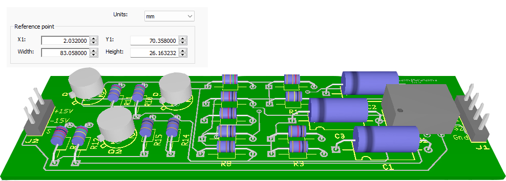

# differential_amplifier
Development and wiring of the differential amplifier circuit

A differential amplifier is an electronic amplifier with two inputs, the output signal of which is equal to the difference in input voltages multiplied by a constant. It is used in cases when it is necessary to isolate a small voltage difference against a significant common-mode component. This amplifier has a gain factor

$$H = \frac{R2}{R1} = \frac{250k}{25k} = 10$$

The circuit is wiered on the board.  

